# Operation Endgame - TryHackMe Write-Up

## Overview
This write-up documents my approach to the TryHackMe **Operation Endgame** room, which focused on enumerating an Active Directory environment, abusing Kerberos-related weaknesses, identifying credential exposure, and escalating privileges to full domain compromise.

## Objectives
- Perform reconnaissance against the target
- Enumerate valid domain users
- Identify accounts vulnerable to Kerberoasting
- Crack recovered ticket hashes
- Validate credentials and identify password reuse
- Analyze privilege escalation paths in Active Directory
- Access the target with recovered credentials
- Retrieve the final flag

## Skills Demonstrated
- Nmap service enumeration
- SMB enumeration
- RID brute-force user enumeration
- Kerberoasting
- Targeted Kerberoasting
- Password hash cracking
- Credential validation
- BloodHound privilege path analysis
- RDP access and post-exploitation
- Active Directory privilege escalation

## Tools Used
- `Nmap`
- `CrackMapExec`
- `Impacket`
- `John the Ripper`
- `BloodHound`
- `xfreerdp`

## Attack Path Summary
1. Identified the target as a Windows Server 2019 Domain Controller
2. Enumerated domain users through RID brute-force using the guest account
3. Performed Kerberoasting against a service account and cracked the recovered hash
4. Cracked the Kerberoast hash, gained access as `CODY_ROY`, and collected more domain information
5. Identified password reuse and gained access to `ZACHARY_HUNT`
6. Performed targeted Kerberoasting to recover `JERRI_LANCASTER`'s credentials
7. Discovered exposed credentials in a script on the target
8. Logged in with the recovered account and obtained the final flag

## 1. Initial Reconnaissance

### Goal
Identify the target services, operating system, and possible attack surface.

### Action
Performed an Nmap scan against the target to enumerate open ports, detect service versions, and determine whether the host was part of an Active Directory environment.

### Commands
    nmap -sC -sV -Pn -oN nmap.txt TARGET_IP

### Screenshots
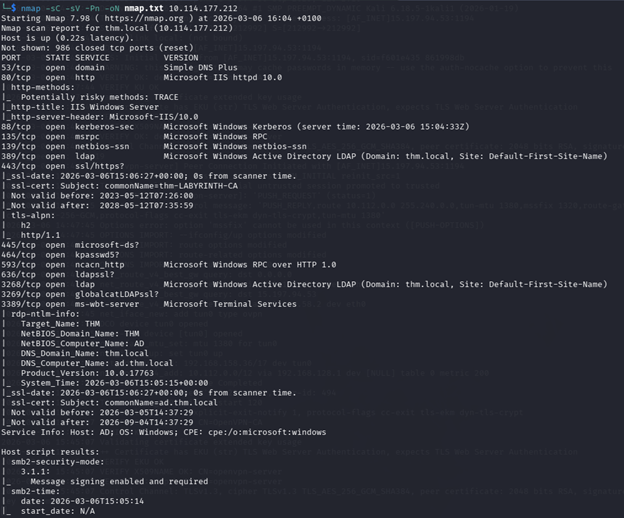

*Figure 1: Nmap scan output showing the target as a Windows Server 2019 Domain Controller in the `thm.local` domain, with key Active Directory-related services exposed.*

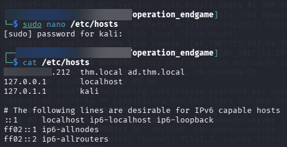

*Figure 2: Added the discovered hostname and domain entry to `/etc/hosts` to simplify communication with the target during later enumeration.*

### Result
The scan identified the target as a `Windows Server 2019 Domain Controller (Build 17763)` in the `thm.local` domain, with the hostname `AD` / `ad.thm.local`.

Key open services included:
- `53` - DNS
- `80/443` - HTTP/HTTPS (`IIS 10.0`)
- `88` - Kerberos
- `135` - RPC
- `389/636` - LDAP / LDAPS
- `445` - SMB
- `3389` - RDP

The scan also showed that `SMB signing` was enabled and required, which suggested that SMB relay attacks would not be a practical option.

After discovering the domain and hostname information, I added the target to my local `/etc/hosts` file so I could reference it by name during later steps.

### Discoveries
- The target was a `Windows Server 2019 Domain Controller`
- The domain was `thm.local`
- The hostname was `AD` / `ad.thm.local`
- Important Active Directory-related services were exposed
- `SMB signing` was enabled and required
- Adding the hostname to `/etc/hosts` would make later interaction easier

### What happened
The initial scan confirmed that the target was not just a standard Windows machine, but the domain controller for the environment. This shifted the focus toward Active Directory enumeration. After identifying the hostname and domain information, I updated `/etc/hosts` locally to make later interaction with the target easier and more reliable.

### Why it mattered
This confirmed that the environment was domain-based and helped guide the next phase of the attack. The exposed services suggested that user enumeration, Kerberoasting, SMB-based checks, and LDAP-related enumeration would be relevant next steps. Adding the host entry also made it easier to work with the target by name in later commands.

## 2. User Enumeration

### Goal
Identify valid domain user accounts that could be targeted in later stages of the attack.

### Action
Used the guest account with a blank password to perform RID brute-force enumeration over SMB, then extracted and cleaned the discovered usernames into a separate user list.

### Commands
    crackmapexec smb x.x.x.212 -u 'guest' -p '' --rid-brute > rid_brute.txt
    cat rid_brute.txt | awk '{print $6}' | awk -F'\\' '{print $2}' | sed -E 's/[0-9]+//g; s/[[:space:]]+/ /g; s/^ //; s/ $//' | sort | uniq > users.txt
    wc -l users.txt

### Screenshots
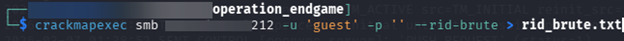

*Figure 3: Used the guest account with a blank password to perform RID brute-force enumeration over SMB.*

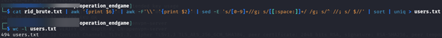

*Figure 4: Extracted usernames from the RID brute-force output, saved them to `users.txt`, and verified the final count.*

### Result
The enumeration showed that the `guest` account could authenticate with a blank password and be used for RID brute-force enumeration. I then parsed the output and saved the discovered usernames to `users.txt`.

The final user list contained `494` usernames.

### Discoveries
- The `guest` account authenticated with a blank password
- RID brute-force worked over SMB
- The discovered usernames were saved to `users.txt`
- The final list contained `494` usernames

### What happened
Instead of relying only on LDAP-based enumeration, I used RID brute-force through SMB to identify domain users directly. This worked with the guest account and produced a much larger username list. After that, I cleaned the output and saved the usernames into a separate file for reuse in later steps.

### Why it mattered
This gave me a large set of valid usernames that could be used in follow-on attacks such as Kerberoasting, credential validation, and password reuse checks. It also confirmed an important weakness early in the engagement: the `guest` account was accessible with a blank password.

## 3. Kerberoasting

### Goal
Look for service accounts that could be targeted with Kerberoasting.

### Action
Used the `guest` account NTLM hash to request service tickets from the domain controller and save any returned TGS hashes for offline cracking.

### Commands
    impacket-GetUserSPNs thm.local/guest -hashes ':31d6cfe0d16ae931b73c59d7e0c089c0' -dc-ip 10.113.142.53 -request -outputfile kerberoast.hash
    cat kerberoast.hash

### Screenshots
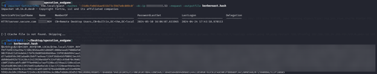

*Figure 5: Used the guest account to request a Kerberos service ticket and save the returned TGS hash for offline cracking.*

### Result
The `guest` account was able to request TGS tickets from the domain controller. This showed that `CODY_ROY` had the SPN `HTTP/server.secure.com` and could be Kerberoasted.

The TGS hash was saved to `kerberoast.hash` for offline cracking.

### Discoveries
- `guest` could request TGS tickets
- `CODY_ROY` had the SPN `HTTP/server.secure.com`
- A Kerberoastable hash was saved to `kerberoast.hash`

### What happened
After confirming that the guest account worked, I used it to check for service accounts with SPNs and request a service ticket for one of them. The request worked, and I got a TGS hash that could be cracked offline.

### Why it mattered
This was an important step because it gave me a way to recover valid credentials from the domain. With only low-level access, I was able to get a crackable service ticket and move further into the environment.

## 4. Cracking the Kerberoast Hash and Access as CODY_ROY

### Goal
Crack the Kerberoast hash, verify the recovered credentials, and see what access the account had in the domain.

### Action
Cracked the TGS hash with John the Ripper, verified the recovered password over SMB, collected BloodHound data, and logged in through RDP to inspect the account interactively.

### Commands
    john kerberoast.hash --wordlist=/usr/share/wordlists/rockyou.txt
    crackmapexec smb 10.113.142.53 -u CODY_ROY -p 'MKO)mko0'

### Screenshots
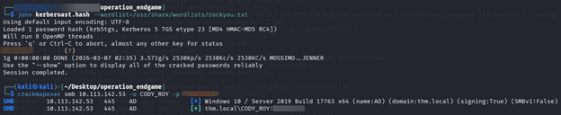

*Figure 6: Cracked the Kerberoast hash with John the Ripper and confirmed the recovered password over SMB.*

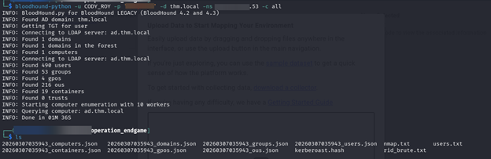

*Figure 7: Collected BloodHound data using the recovered `CODY_ROY` credentials.*

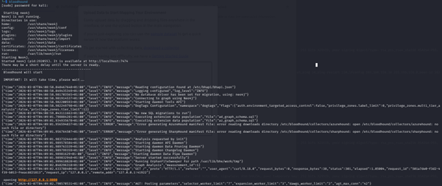

*Figure 8: Started BloodHound to review collected domain data and possible attack paths.*

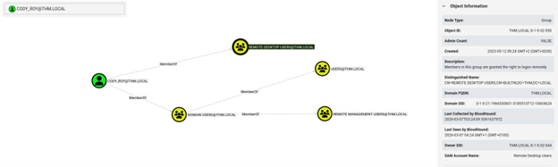

*Figure 9: BloodHound showed that `CODY_ROY` was a member of the `Remote Desktop Users` group.*

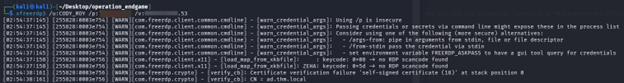

*Figure 10: Used the recovered credentials to connect to the target through RDP.*

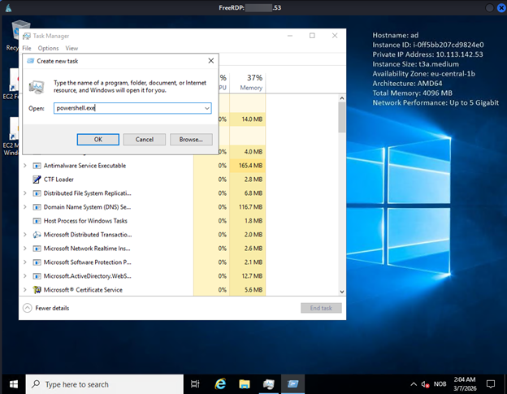

*Figure 11: Opened `powershell.exe` from Task Manager because normal clicking inside the remote session was not working properly.*

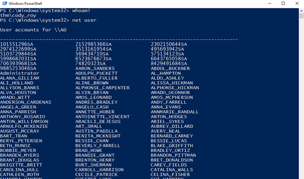

*Figure 12: Used `net user` after logging in as `CODY_ROY` to view domain user accounts from the remote session.*

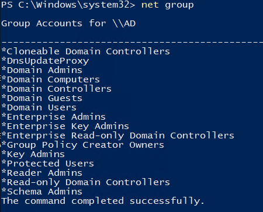

*Figure 13: Used `net group` to review domain groups from the remote session.*

### Result
The Kerberoast hash was cracked successfully, and the recovered password for `CODY_ROY` was verified over SMB.

BloodHound data was then collected and reviewed. The results showed that `CODY_ROY` was a member of the `Remote Desktop Users` group, which made RDP access possible.

After logging in remotely, I was able to run commands and do some basic enumeration. However, this account did not have administrative privileges, so I could not access anything especially useful or retrieve the flag at this stage.

### Discoveries
- `CODY_ROY`'s password was cracked successfully
- The credentials worked over SMB
- `CODY_ROY` was a member of `Remote Desktop Users`
- RDP access was possible
- The account did not have administrative privileges

### What happened
Cracking the Kerberoast hash gave me the first real set of working user credentials in the environment. After confirming the password, I used the account to collect BloodHound data and better understand the account's position in the domain.

The BloodHound results showed that the user had remote logon rights, so I connected through RDP. Because the desktop session was difficult to interact with normally, I used Task Manager to launch PowerShell and continue enumeration from there. I checked domain users and groups, but the account did not have enough privileges to reach the final objective.

### Why it mattered
This step turned the Kerberoast result into real access on the target. It confirmed that the cracked credentials were valid, allowed interactive access through RDP, and provided more visibility into the domain. Even though `CODY_ROY` was not an administrator, this account gave a stronger foothold and helped identify the next direction for privilege escalation.

## 5. Password Reuse and BloodHound Findings

### Goal
Check whether `CODY_ROY`'s password was reused by other domain users and identify a possible path to move further in the domain.

### Action
Sprayed `CODY_ROY`'s password against the discovered user list, verified the successful login for `ZACHARY_HUNT`, and reviewed BloodHound findings to understand what access that account could lead to.

### Commands
    crackmapexec smb 10.113.142.53 -u users.txt -p 'MKO)mko0' --continue-on-success | grep "+"
    crackmapexec smb 10.113.142.53 -u ZACHARY_HUNT -p 'MKO)mko0'

### Screenshots
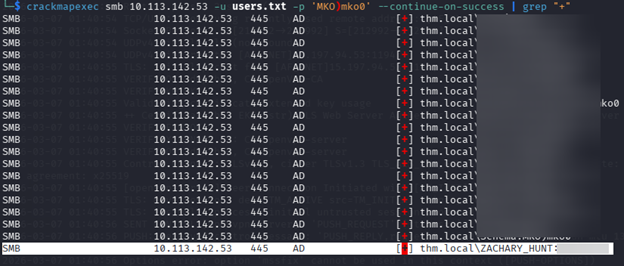

*Figure 14: Sprayed `CODY_ROY`'s password against the discovered user list and filtered the output to show successful logins.*

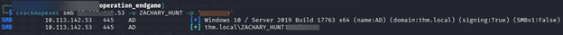

*Figure 15: Verified that `ZACHARY_HUNT` also used the same password.*

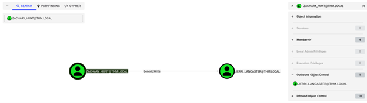

*Figure 16: BloodHound showed that `ZACHARY_HUNT` had `GenericWrite` permission over `JERRI_LANCASTER`.*

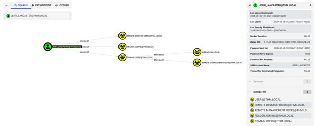

*Figure 17: BloodHound showed that `JERRI_LANCASTER` was a member of the `Reader Admins` group.*

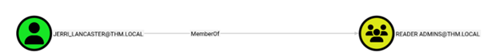

*Figure 18: The BloodHound findings showed a path that made a targeted Kerberoast attack possible.*

### Result
The password spray showed that `ZACHARY_HUNT` also used the password `MKO)mko0`.

After verifying the credentials, BloodHound showed that `ZACHARY_HUNT` had `GenericWrite` permission over `JERRI_LANCASTER`. It also showed that `JERRI_LANCASTER` was a member of the `Reader Admins` group.

This meant that I could add an SPN to `JERRI_LANCASTER` and then Kerberoast that account.

### Discoveries
- Password reuse was found
- `ZACHARY_HUNT` used the same password as `CODY_ROY`
- `ZACHARY_HUNT` had `GenericWrite` over `JERRI_LANCASTER`
- `JERRI_LANCASTER` was a member of `Reader Admins`
- A targeted Kerberoast path was possible

### What happened
After gaining access as `CODY_ROY`, I checked whether the same password was reused by other users in the domain. That worked and led to another valid account, `ZACHARY_HUNT`.

From there, I used BloodHound to understand what that account could do. The results showed that `ZACHARY_HUNT` had control over `JERRI_LANCASTER` through `GenericWrite`. Since that can be abused to add an SPN to the target account, it created a clear path for a targeted Kerberoast attack.

### Why it mattered
This was a key step because it showed password reuse in the domain and turned one recovered password into access to another useful account. More importantly, it revealed a direct path to a higher-value target that could be abused in the next stage of the attack.

## 6. Targeted Kerberoasting JERRI_LANCASTER

### Goal
Use `ZACHARY_HUNT`'s access to request a Kerberos service ticket for `JERRI_LANCASTER` and recover that account's password.

### Action
Used `targetedKerberoast.py` with the `ZACHARY_HUNT` credentials to request a Kerberos service ticket for `JERRI_LANCASTER`, then verified the recovered password over SMB.

### Commands
    python3 /opt/targetedKerberoast/targetedKerberoast.py -d 'thm.local' -u 'ZACHARY_HUNT' -p 'MKO)mko0' --request-user 'JERRI_LANCASTER' --dc-ip 10.113.142.53 -o jerri.hash

Cracking JERRI_LANCASTER's Hash

    crackmapexec smb 10.113.142.53 -u JERRI_LANCASTER -p 'lovinlife!'

### Screenshots
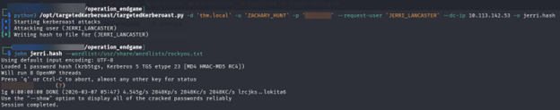

*Figure 19: Used `ZACHARY_HUNT`'s access to perform a targeted Kerberoast against `JERRI_LANCASTER` and recover a crackable hash.*

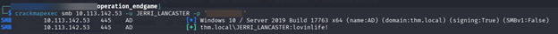

*Figure 20: Verified the recovered `JERRI_LANCASTER` password over SMB.*

### Result
The targeted Kerberoast attack worked and revealed that the password for `JERRI_LANCASTER` was `lovinlife!`.

I then verified the credentials over SMB to confirm that the password was valid.

### Discoveries
- `JERRI_LANCASTER : lovinlife!`

### What happened
After finding that `ZACHARY_HUNT` had `GenericWrite` over `JERRI_LANCASTER`, I used that access to perform a targeted Kerberoast attack. This gave me a Kerberos service ticket for `JERRI_LANCASTER`, which I then cracked offline.

Once the password was recovered, I tested it over SMB to confirm that the account was usable.

### Why it mattered
This step moved the attack forward by turning the `GenericWrite` permission into another set of valid credentials. It showed how an ACL abuse path in Active Directory could be combined with Kerberoasting to gain access to a more useful account.

## 7. Credential Discovery in `C:\Scripts`

### Goal
Look for exposed credentials or useful files that could help me move further in the attack.

### Action
Checked the `C:\Scripts` directory after gaining access and reviewed the script contents for hardcoded credentials. After finding a username and password in the script, I verified the credentials over SMB.

### Commands
    crackmapexec smb 10.113.142.53 -u SANFORD_DAUGHERTY -p 'RESET_ASAP123'

### Screenshots
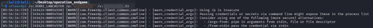

*Figure 21: Accessed the `C:\Scripts` directory while enumerating the target.*

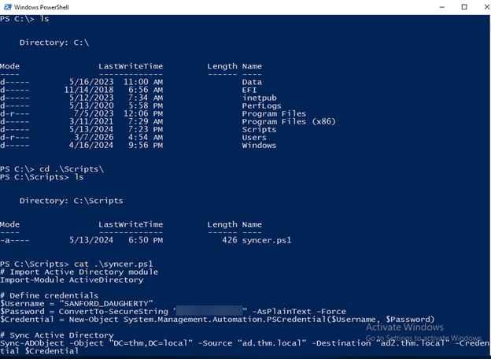

*Figure 22: Found a script containing hardcoded credentials for another domain user.*

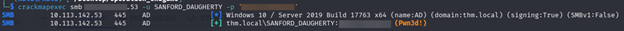

*Figure 23: Verified the recovered `SANFORD_DAUGHERTY` credentials over SMB.*

### Result
Inside the script, I found the following credentials:

    $Username = "SANFORD_DAUGHERTY"
    $Password = ConvertTo-SecureString "RESET_ASAP123" -AsPlainText -Force

I then verified the password over SMB and confirmed that the credentials were valid.

### Discoveries
- `SANFORD_DAUGHERTY`
- `RESET_ASAP123`
- Credentials were stored in plain text inside a script
- The recovered credentials worked over SMB

### What happened
After getting further access in the environment, I checked the `C:\Scripts` folder for anything useful. One of the scripts contained hardcoded credentials for `SANFORD_DAUGHERTY`. I then tested the password over SMB and confirmed that the account was usable.

### Why it mattered
This gave me another valid set of credentials without needing to crack anything further. It also showed poor credential handling in the environment, since sensitive account details were stored directly in a script.

## 8. Retrieving the Flag

### Goal
Use the recovered `SANFORD_DAUGHERTY` credentials to gain higher access on the target and retrieve the final flag.

### Action
Logged in to the target through RDP with the recovered credentials, opened Task Manager, launched a new command prompt with administrative privileges, and read the flag from the Administrator desktop.

### Commands
    xfreerdp3 /u:SANFORD_DAUGHERTY /p:'RESET_ASAP123' /v:10.113.142.53

Open Task Manager → File → Run new task

Type `cmd` → tick **Create this task with administrative privileges** → OK

Then run:

    type C:\Users\Administrator\Desktop\flag.txt.txt

### Screenshots
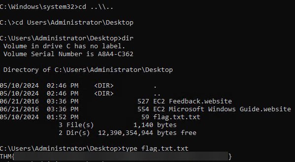

*Figure 24: Retrieved the final flag after gaining high-level access on the target.*

### Result
The final flag was successfully retrieved from the Administrator desktop:

    THM{INFILTRATION_COMPLETE_OUR_COMMAND_OVER_NETWORK_ASSERTS}

### Discoveries
- Successfully retrieved the final flag as Domain Admin
- Full domain compromise achieved

### What happened
After recovering the `SANFORD_DAUGHERTY` credentials, I logged in through RDP and used Task Manager to start a command prompt with administrative privileges. From there, I accessed the Administrator desktop and read the final flag file.

### Why it mattered
This confirmed the full attack path from initial enumeration to complete domain compromise. By this stage, the chain of weaknesses had led all the way to Domain Admin-level access and successful flag retrieval.

## Lessons Learned

This room was a good reminder that full compromise does not always come from one big mistake. In this case, it came from several smaller weaknesses working together.

I learned how useful RID brute-force can be for finding valid users, how Kerberoasting can turn basic access into real credentials, and how password reuse can quickly make a bad situation worse. I also saw how helpful BloodHound is for finding paths between accounts and spotting permission issues that are easy to miss by hand.

Another important lesson was how dangerous poor credential handling can be. Finding hardcoded credentials in a script made it clear how one small oversight can help an attacker move much further than expected.

Overall, this room helped me understand how Active Directory attacks often build step by step, with each weakness making the next one easier to abuse.
